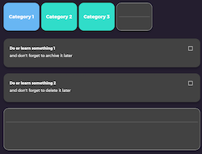

# Notes

An example Flutter Notes management app backed by Firebase Firestore

Uses Async Redux (https://pub.dev/packages/async_redux) as a state management approach

TODO:
- Add and init Firebase projects for Android/iOS)
- Add Firebase auth
- Сode/decode database entities directly to Dart classes